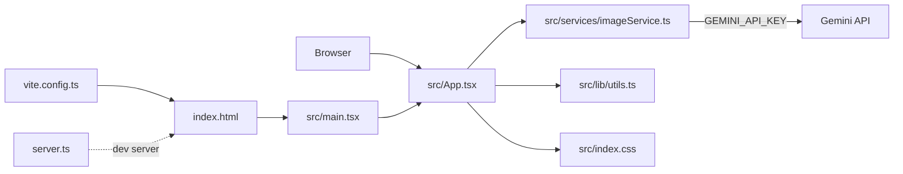

# 六赫茲 19+1

> AI Studio app · React + TypeScript + Vite + Gemini API

**Author**: [@Lee-unhn](https://github.com/Lee-unhn) · a2264563@gmail.com

## 專案簡介 / Overview

從 Google AI Studio 匯出的應用程式骨架，串接 Gemini API 做影像相關處理。前端用 React 19 + Vite 開發，含一個輕量 Express/Node 風格的 `server.ts` 供本地 dev。

AI Studio source: <https://ai.studio/apps/944563e1-29d6-42fc-aee0-a7106a827397>

## 架構 / Architecture



## 技術棧 / Tech Stack

- **Framework** · React 19 + TypeScript
- **Build** · Vite
- **AI** · Google Gemini API (`@google/genai` 或同類 SDK，見 `package.json`)
- **Dev server** · `server.ts` (Node)
- **Config** · `.env.local` 放 `GEMINI_API_KEY`

## 主要檔案 / Key Files

- `src/App.tsx` · 主元件
- `src/services/imageService.ts` · 影像相關服務（呼叫 Gemini）
- `src/main.tsx` · 入口
- `server.ts` · 本地 dev server
- `vite.config.ts` · Vite 設定
- `metadata.json` · AI Studio 應用 metadata

## 使用 / Usage

**Prerequisites**: Node.js

1. 安裝依賴：
   ```bash
   npm install
   ```
2. 在 [.env.local](.env.local) 設定 `GEMINI_API_KEY` 為你的 Gemini API key
3. 啟動：
   ```bash
   npm run dev
   ```

## License

Unlicensed (personal project) — 若要使用請先聯絡作者。
